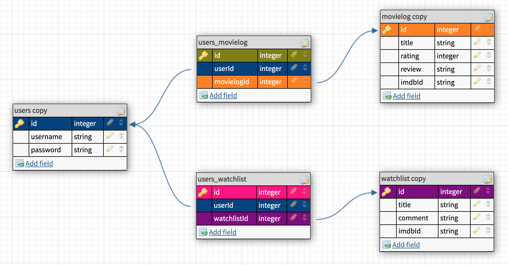
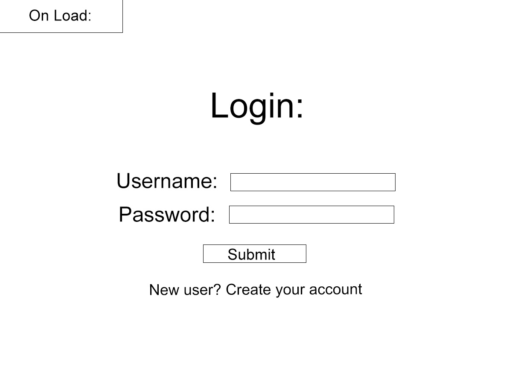
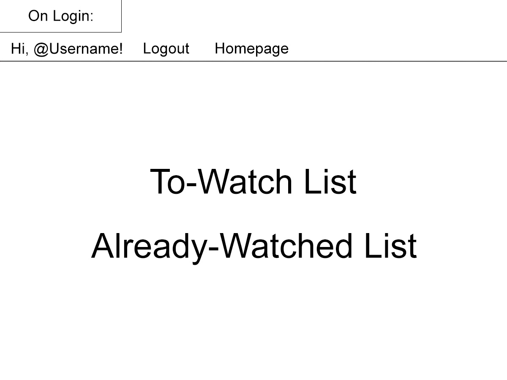
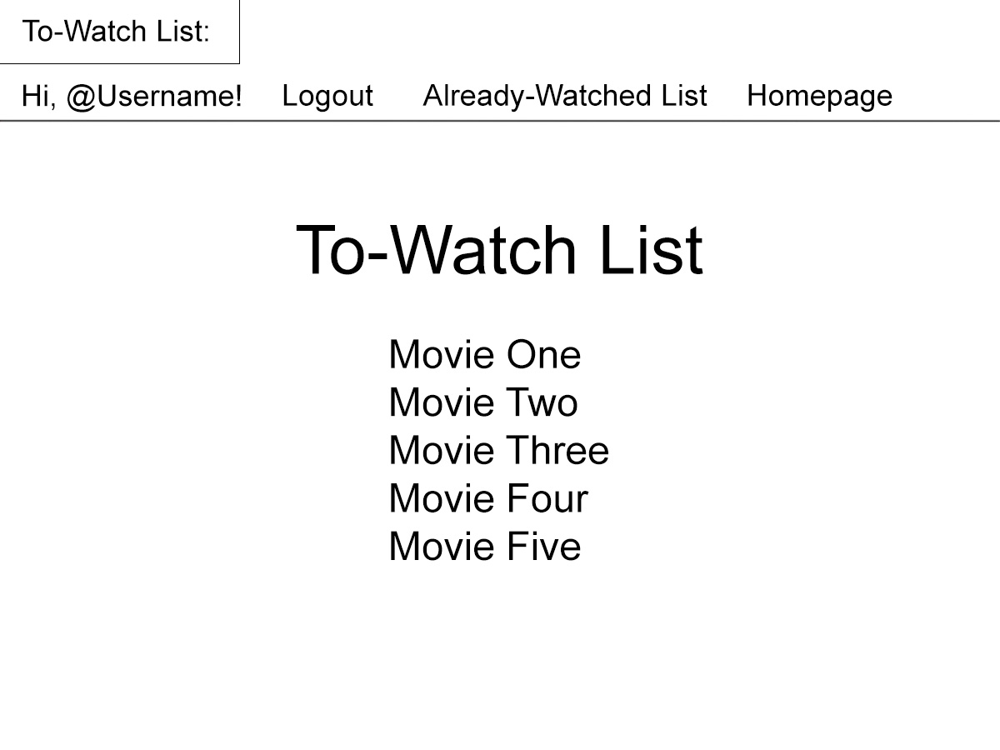
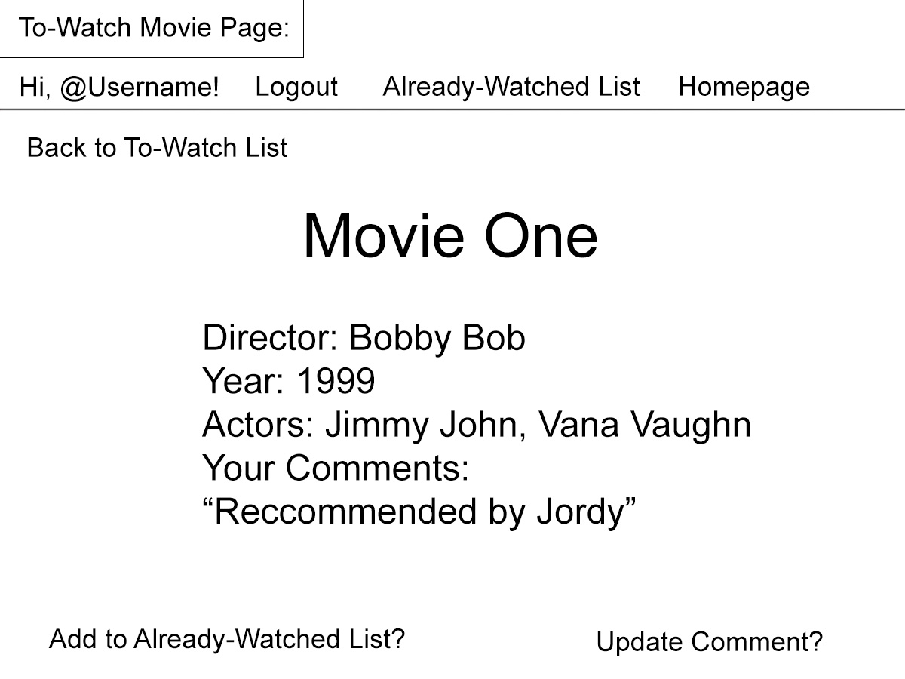
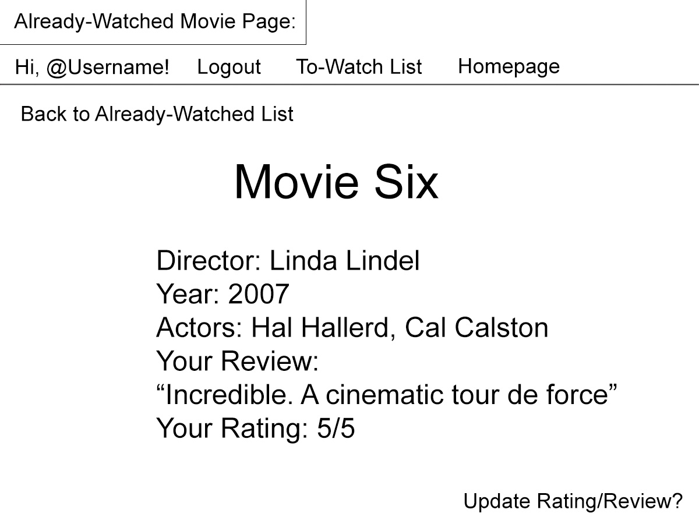
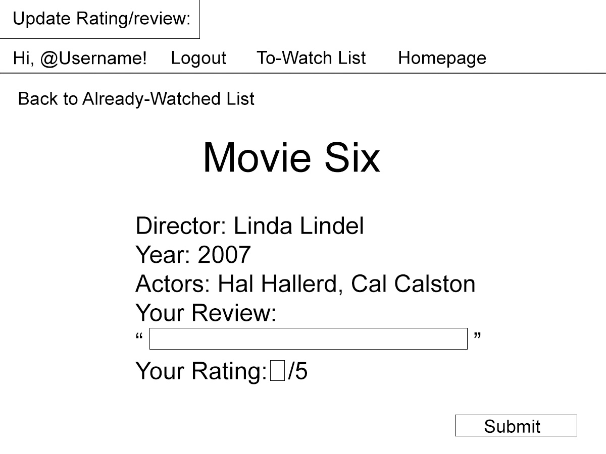

# Project 2

## Overview
This app will allow users to login and search the Omdb API to create watch-lists of movies they would like to see as well as logs of movies they have already seen.
In addition, users will be able to review and rate movies they've already seen. This is to help users keep track of films they've enjoyed and to aid them in choosing future movies to watch.

In addition, as a stretch goal, users will be able to build a list of movies they would like to watch using a system of randomized criteria. The rubric is designed to help reduce feelings of choice-fatigue as well as push users to watch movies that they might not otherwise.

## MVP Goals
Users will be able to login and interact with their profile consisting of movies they would like to watch, with the ability to comment on them, as well as reviews and ratings of movies that they've already seen.

The database will inlcude models for movies and user input (comments, reviews, and ratings).

## Stretch Goals
Users will be able to build a list of 20 movies and use a virtual d20 die to select which movie on the list they will watch. The list is filled out by the user conducting a separate d20 die roll and choosing a movie according to the roll's corresponding criteria (eg. rolling a 12 might mean you have to choose a movie within the sci-fi genre

## Extra Stretch
- Include sub wheels (i.e., if they roll 10 when building the list, they are sent to "Decades" wheel which necessitates an additional roll of a virtual six-sided die with each roll possibility corresponding to a decade from which the user must select the movie.)
- Possibility to build watch-lists collaboratively

## User Stories
On the homepage, users are prompted to either log in or create an account. From there, they are taken to their profile with links to their lists of want-to-watch movies and already-watched movies.

Users are able to build their lists of want-to-watch movies or already-watched movies by navigating to the bottom of either list page and searching Ombd's database according to queries including title, actor, director, or genre and then clicking a button to add them to either list. 

Users are able to add general notes to movies they would like to watch (i.e. "Reccommended by Jordy," "Has Vincent Price") and to review and rate movies that they have seen. 

Once users have a watched a movie from their want-to-watch list, they will be able to move it to the already-watched list and rate/review it. Users will also have the option to update their ratings/reviews.

## About the Omdb API
The Omdb API contains information on movies similar to what can be found on Imdb. For example, searching for "Dirty Harry" would return the following JSON data:

    {"Title":"Dirty Harry","Year":"1971","Rated":"R","Released":"23 Dec 1971","Runtime":"102 min","Genre":"Action, Crime, Thriller","Director":"Don Siegel","Writer":"Harry Julian Fink (screenplay), Rita M. Fink (screenplay), Dean Riesner (screenplay), Harry Julian Fink (story), Rita M. Fink (story)","Actors":"Clint Eastwood, Harry Guardino, Reni Santoni, John Vernon","Plot":"When a madman calling himself \"the Scorpio Killer\" menaces the city, tough-as-nails San Francisco Police Inspector \"Dirty\" Harry Callahan is assigned to track down and ferret out the crazed psychopath.","Language":"English","Country":"USA","Awards":"2 wins & 4 nominations.","Poster":"https://m.media-amazon.com/images/M/MV5BMzdhMTM2YTItOWU2YS00MTM0LTgyNDYtMDM1OWM3NzkzNTM2XkEyXkFqcGdeQXVyNjc1NTYyMjg@._V1_SX300.jpg","Ratings":[{"Source":"Internet Movie Database","Value":"7.7/10"},{"Source":"Rotten Tomatoes","Value":"89%"},{"Source":"Metacritic","Value":"90/100"}],"Metascore":"90","imdbRating":"7.7","imdbVotes":"143,709","imdbID":"tt0066999","Type":"movie","DVD":"15 Aug 2008","BoxOffice":"$35,976,000","Production":"Malpaso Company, Warner Brothers","Website":"N/A","Response":"True"}

Users will interact with this information to build their movie lists.

## Daily Sprints
### Monday:
- Wireframe app
- Plan database ERD
- Plan RESTful routing chart 
- Complete READme

### Tuesday:
- Create db models -- test db
- Stub routes -- test routes
- Build routes

### Wednesday:
- Finish routes
- Create views

### Thursday:
- Finish views
- Start movie choosing game

### Friday:
- Debug refactor
- Style views
- Continue movie choosing game

### Saturday:
- Style views
- Stretch goals
- Continue movie choosing game

### Sunday:
- Stretch goals
- Additional styling
- Continue Movie choosing game

## Database ERDs

## Wireframes
### On Load/Homepage:

### Display Login:

### Create Account:

### On Login:

### To-Watch List:

### To-Watch Movie Page:

### Update Comment:

### Already-Watched List:

### Already-Watched Movie Page:

### Update Review:

## RESTful Routing Chart
 Method | URL | Functionality | View 
 --- | --- | --- | ---
 GET | /users/new | Display create account form | Render users/new.ejs 
 POST | /users | Creates a new account | Redirect to /users      
 GET | /users/profile | Displays links to user watchlist and movielog | Render users/profile.ejs
 GET | /users/login | Display login form | Render users/login.ejs
 POST | /users/login | Receives and checks login information and stores the cookie if user information is a match  | Redirect to /users/profile or /users/login.ejs, depending on whether login info is a match
 GET | /users/logout | Logs the user out and clears the cookie | Redirect to /users
 GET | /watchlist | Displays all movies on the users watchlist | Show watchlist/index.ejs
 POST | /watchlist | Adds movies to the watchlist via a form attached to search query results | Redirect to /watchlist
 GET | /watchlist/:id| Show details about a specific movie on the user's watchlist | Render watchlist/show.ejs
 PUT | /watchlist/:id| Adds or updates a comment on movie on the user's watchlist | Redirect to /watchlist/:id
 DELETE | /watchlist/:id | Removes a movie from the user's watchlist | Redirect to /watchlist
 GET | /movielog | Displays all movies from the user's movielog | Render movielog/index.ejs
 POST | /movielog | Adds movies to the user's movielog via a form attached to search query results and the user's watchlist | Redirect to /movielog
 GET | /movielog/:id| Show details about a specific movie from the user's movielog | Render movielog/show.ejs
 PUT | /movielog/:id| Adds or updates a user comment on a movie from the user's movielog | Redirect to /watchlist/:id
 DELETE | /movielog/:id | Removes a movie from the user's movielog | Redirect to /movielog

 ## Stretch
  Method | URL | Functionality | View 
 --- | --- | --- | ---
 GET | /randomqueue | Displays all movies from the user's randomqueue | Render randomqueue/index.ejs
 POST | /randomqueue | Adds movies to the user's moviequeue via a form attached to search query results and the user's watchlist | Redirect to /randomqueue
 GET | /randomqueue/:id| Show details about a specific movie from the user's randomqueue | Render randomqueue/show.ejs
 DELETE | /randomqueue/:id | Removes a movie from the user's randomqueue  | Redirect to /randomqueue 